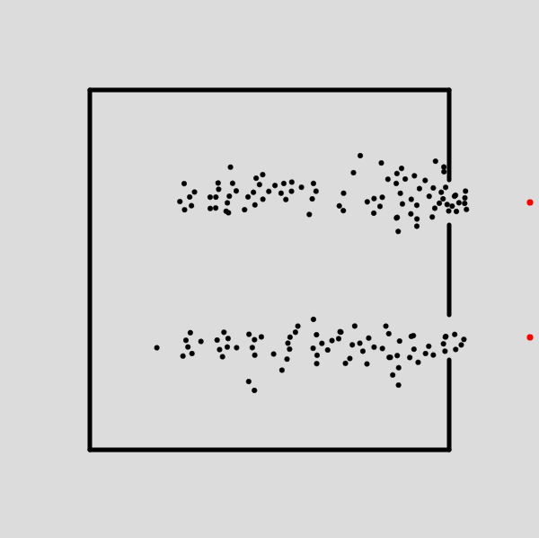

<h3>Evacuation Simulation using Particle Swarm Optimization</h3>

To run the program: load PSO.js into https://editor.p5js.org/ and click play.  
Different setups can be found in setups.txt. Replace the target at line 7 with the target given for the chosen setup, and replace the walls at line 298 with the walls given for the chosen setup.  

Below an image is added of what a run should look like mid-run, with the setup with two extis. The particles here are all moving towards the red dots (and disappearing before reaching the red dot when it is detected they have escaped the room)

